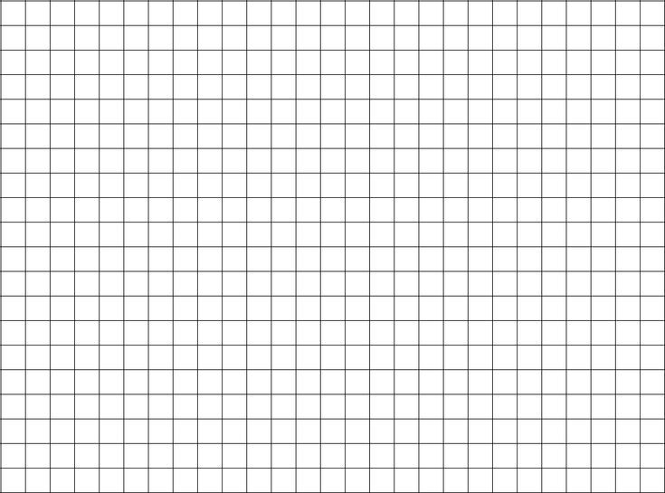
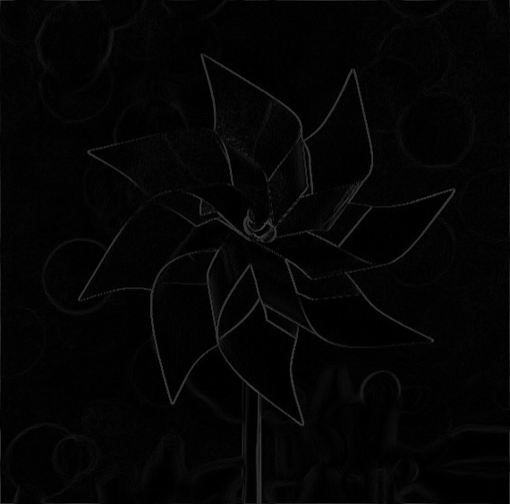

# Projects 1 & 2: Brush & Filter

2D interactive drawing board and image editor. The drawing board supports flexible brush flows (constant, linear, quadratic, smudge, spray, fill, and alpha blending), brush sizes, brush colors. The image editor supports imgae filters (3 blurring, 2 edge detection), image scaling and rotating, chromatic abberation, tone mapping, etc. This project associates with Brown CSCI 2230 Computer Graphics course and all project handouts can be found [here](https://browncsci1230.github.io/projects).

## Part 1: Interactive Draw Board

The project handout can be found [here](https://cs1230.graphics/projects/raster/1).

### Brush
<!-- This is how you will demonstrate the functionality of your project.

For each of the rows below, follow the instructions to record a video. Please reference the [Screen Recording Guide](https://cs1230.graphics/docs/screen-recording/) for machine-specific guidance on how to do this.

Once you've recorded everything, navigate to this file in Github, click edit, and either select or drag-and-drop each of your videos into the correct location. This will upload them to GitHub (but not include them in the repo) and automatically embed them into this Markdown file by providing a link. Make sure to double-check that they all show up properly in the preview.

> Note: you can ignore the `student_outputs` folder in the repo for now. You will be using it in the next project, Filter.

We're **not** looking for your video to **exactly** match the expected output (i.e. draw the exact same shape). Just make sure to follow the instructions and verify that the recording fully demonstrates the functionality of that part of your project. -->

#### Constant Brush
**Instructions:** Draw with the constant brush.

##### Expected Output

https://github.com/BrownCSCI1230/projects_raster_template/assets/77859770/241d99b5-947a-407c-b454-410534520aad

##### Your Output


https://github.com/BrownCSCI1230/projects-raster-Junyu-Liu-Nate/assets/75256586/c5ecc457-b425-47a3-bb3a-4fd3a3e758fc


<!---
Paste your output on top of this comment!
-->


#### Linear Brush
**Instructions:** Draw with the linear brush.

##### Expected Output

https://github.com/BrownCSCI1230/projects_raster_template/assets/77859770/9706fa04-7710-441f-b292-ab010e04dec6

##### Your Output


https://github.com/BrownCSCI1230/projects-raster-Junyu-Liu-Nate/assets/75256586/2d752441-d97c-4634-a8c7-14c5db67afd0


<!---
Paste your output on top of this comment!
-->


#### Quadratic Brush
**Instructions:** Draw with the quadratic brush.

##### Expected Output

https://github.com/BrownCSCI1230/projects_raster_template/assets/77859770/c5df5c09-bfe0-4c05-a56e-14609772d675

##### Your Output


https://github.com/BrownCSCI1230/projects-raster-Junyu-Liu-Nate/assets/75256586/869493c6-138f-44d9-8c37-e6db8a2732cc


<!---
Paste your output on top of this comment!
-->


#### Smudge Brush
**Instructions:** Draw some colors on the canvas and use the smudge brush to smear them together.

##### Expected Output

https://github.com/BrownCSCI1230/projects_raster_template/assets/77859770/26440b63-2d1c-43fd-95f2-55b74ad3bbed

##### Your Output


https://github.com/BrownCSCI1230/projects-raster-Junyu-Liu-Nate/assets/75256586/10b6dac2-c8cd-4f63-ac32-9a20c9ddfa38


<!---
Paste your output on top of this comment!
-->


#### Smudge Brush Change in Alpha
**Instructions:** Draw some colors on the canvas. Use the smudge brush with varying alpha levels (use at least three) and demonstrate that the brush still works the same way each time.

##### Expected Output

https://github.com/BrownCSCI1230/projects_raster_template/assets/77859770/0b49c7d0-47ca-46d0-af72-48b831dfe7ea

##### Your Output


https://github.com/BrownCSCI1230/projects-raster-Junyu-Liu-Nate/assets/75256586/3adc496f-c808-418b-acec-b1dbfc91dd68


<!---
Paste your output on top of this comment!
-->


#### Radius
**Instructions:** Use any brush with at least 3 different values for the radius.

##### Expected Output

https://github.com/BrownCSCI1230/projects_raster_template/assets/77859770/6f619df6-80cd-4849-8831-6a5aade2a517

##### Your Output


https://github.com/BrownCSCI1230/projects-raster-Junyu-Liu-Nate/assets/75256586/65c5d0ba-d115-480d-8290-26f861830015


<!---
Paste your output on top of this comment!
-->


#### Color
**Instructions:** Use any brush to draw red (255, 0, 0), green (0, 255, 0), and blue (0, 0, 255).

##### Expected Output

https://github.com/BrownCSCI1230/projects_raster_template/assets/77859770/fd9578ca-e0af-433e-ac9e-b27db2ceebc9

##### Your Output


https://github.com/BrownCSCI1230/projects-raster-Junyu-Liu-Nate/assets/75256586/3be1bf31-ff41-4088-beaa-23a3be474e9e


<!---
Paste your output on top of this comment!
-->


#### Canvas Edge Behavior
**Instructions:** With any brush, click and draw on the canvas in a place where the mask intersects with the edge. Then, start drawing anywhere on the canvas and drag your mouse off of the edge.

##### Expected Output

https://github.com/BrownCSCI1230/projects_raster_template/assets/77859770/f5344248-fa5f-4c33-b6df-ff0a45011c7a

##### Your Output


https://github.com/BrownCSCI1230/projects-raster-Junyu-Liu-Nate/assets/75256586/be5e7e99-941a-4ab7-bec3-7173b594d36f


<!---
Paste your output on top of this comment!
-->


#### Alpha
**Instructions:** With the constant brush, draw a single dot of red (255, 0, 0) with an alpha of 255. Then, draw over it with a single dot of blue (0, 0, 255) with an alpha of 100. You should get a purpleish color.

##### Expected Output

https://github.com/BrownCSCI1230/projects_raster_template/assets/77859770/b13d312d-d6d4-4375-aeaa-96174065443b

##### Your Output


https://github.com/BrownCSCI1230/projects-raster-Junyu-Liu-Nate/assets/75256586/ce3fd5aa-6f67-4b59-b668-6de7ac302a4a


<!---
Paste your output on top of this comment!
-->


#### Alpha of Zero
**Instructions:** Choose any brush and demonstrate that it will not draw if the alpha value is zero.

##### Expected Output

https://github.com/BrownCSCI1230/projects_raster_template/assets/77859770/8e48777e-8196-401e-9af6-871abe712146

##### Your Output


https://github.com/BrownCSCI1230/projects-raster-Junyu-Liu-Nate/assets/75256586/ee7da044-c527-43cc-a258-44bf7d068563

<!---
Paste your output on top of this comment!
-->


### Design Choices

#### Functionality

##### Generals:
- All brushes are stored and updated as masks and updated properly according to the specification.
- All broundary situations are considered and tested.
- All functions are tested according to the demonstration videos and all of the shown operations are functioned normally. Some additional tests are covered including different edge situations or overlapping (e.g., in the output of Fill Brush in the document) to reduce the probability of stability bugs.

##### Explanation for functionalities:
- **Constant/linear/quadratic Brush**: The detailed guidance is covered in the project specifications and in algo1, thus here I don't do additional explanation.

- **Smudge Brush**: The key to implement smudge brush is to store the color where the previous brush the mouse covered, and mix with the brush of the mouse currently covered.

- **Spray Brush**: Spray mask is generated by setting opacity of value 0 or 1  according to the density value. A random seed is generated by calling ```arc4random_uniform(100)``` to generate a random number between 0 and 100, and it is compared to the density value. In such manner, when density is 0, all values are 0 and when density is 100, all values are 1 (constant brush). In other density values, the probability of a value to be 1 is ```arc4random_uniform(100) / density```.
  
- **Speed Brush**: The key to implement the speed brush is to calculate the speed of the mouse dragging, which is implemented by storing the previous location of the mouse dragged and compare the current location to calculate the mouse moving distance in a unit time. Since the event calling/sampling time interval is uniform, such distance can be used to determine the speed of the mouse in a unit time.Then, the radius of brush is calculated by ```(1.0 - scale) * settings.brushRadius + scale * settings.brushRadius / (unitSpeed + 1.0)```, where scale is a parameter to control the changing rate of the radius. Such calculation enables a visually smooth changing of the brush radius and maintains the max radius of ```ettings.brushRadius``` when the speed is 0.

- **Fill**: The main idea for Fill is to implement a recursive filling process where starts at the clicking position of the mouse and iteratively proceed towards the upper left, upper right, lower left, and lower right of the current pixel until all the neighbors are filled with the same color or reach to the boundary of the canvas. To speed up the procdure for filling the whole canvas  when clicking on empty canvas, there is a pre-check for whether the canvas is empty and fill the empty canvas by directly assign every entry of the canvas array to the designated color.

- **Fixed Alpha Blending**: The main idea for Fixed Alpha Blending is to track where the masks are already covered in one stroke. If the current covering of mask contains the previously tracked pixels, update the color until the color reaches the max color of a stroke under the alpha value (an upper bound). When choosing Constant Brush, such implementation equals not updating previously tracked pixels. When choosing Linear or Quadratic Brush, this implementation updates the color to the max color under current alpha value (i.e., the value when using Constant Brush). Thus, there will be no repeated overlapping of colors in one stroke.

#### Software Engineering, Efficiency, Stability
- Operation codes (e.g., updating masks, handing mouse events, etc.), object codes (e.g., masks, storing structures), and functional codes (e.g., helper functions like converting from 2D cood to 1D, checking functions, comparing functions, etc.) are all properly separated and packed into functions. Functions are properly called and reused to reduce unecessarily long and concoluted code.
- The code are properly annotated and organized in blocks for better readability.
- Reduce the times of updating masks: When settings are changed, there is no immediate update of the mask untill mouse is pressed down. When mouse is pressed down, the settings are freezed untile the next time the settings are changed.
- For additional stability testing, multiple tests have been conducted on the canvas by trying different operation orders, speeds, and even randomly clikcing to check whether the program would crash, to reduce the probability of stability bugs.


<!-- ### Collaboration/References
I clarify that there is no collaboration or reference include when I do this project, -->

### Known Bugs

For fixed alpha blending, if using Linear and Quadratic Brush and dragging the mouse extremely fast, there may be some darker areas (looking like fish scales) in one stroke. This doesn't happen when drawing at a normal or slow speed and don't happen for Constant brush at all. There are some possible reasons for this and I have attempted to solve them:
- Rounding error when tracking/storing and updating the RGBA values, in which multiple float-int transformations happen. I have tried the standard way to add 0.5f when transforming from float to int, and used static_cast<float> to transform from int to float. The fish scales effect looks much less obvious, but it still occurs when drawing extremely fast.
-  Efficiency of the algorithm may cause this problem. I've tried to optimize the efficiency by removing unnecessary value updates and reduce looping operations, but it still occurs when drawing extremely fast.

### Extra Credit

#### Spray

My output:

https://github.com/BrownCSCI1230/projects-raster-Junyu-Liu-Nate/assets/75256586/4a39b734-6b2b-4c39-912c-39cd4c1dba70


#### Speed

My output:

https://github.com/BrownCSCI1230/projects-raster-Junyu-Liu-Nate/assets/75256586/ed1b7173-d4e8-4552-a27a-f5ccf0aa85a4


#### Fill

My output:

https://github.com/BrownCSCI1230/projects-raster-Junyu-Liu-Nate/assets/75256586/34ab5fbc-52dc-4b8f-b975-7246364bdef5


#### Fixed Alpha Blending
My output for Const Brush:

https://github.com/BrownCSCI1230/projects-raster-Junyu-Liu-Nate/assets/75256586/21900790-b35a-4272-8887-21985ffcbba3

My output for Linear Brush:

https://github.com/BrownCSCI1230/projects-raster-Junyu-Liu-Nate/assets/75256586/e165decf-dde1-4587-b5de-df3c0a406e37

My output for Qudratic Brush:

https://github.com/BrownCSCI1230/projects-raster-Junyu-Liu-Nate/assets/75256586/bed8cf96-78fe-40dd-a5cc-9c646b9279c0

## Part 2: Image Editing

The project handout can be found [here](https://cs1230.graphics/projects/raster/2).

### Filters and Image Operations

<!-- This is how you will demonstrate the functionality of your project.

Unlike Brush, you will be submitting images instead of videos for Filter.

We provide the functionality for saving the canvas of your running Filter program to a file. By default, the save dialog should open to the `student_outputs` folder, which is where the table below expects your images to be. If it does not, check that you have set your working directory to the root of the project (i.e. the folder that contains `CMakeLists.txt`).

**Do not** use your system screenshot tool or any other method to capture the canvas. You must use the save functionality provided by the program.

> Note: once all images are filled in, the images will be the same size in the expected and student outputs. -->

|                                                                                             Instructions                                                                                              |                             Expected Output                             |                                      Your Output                                      |
| :---------------------------------------------------------------------------------------------------------------------------------------------------------------------------------------------------: | :---------------------------------------------------------------------: | :-----------------------------------------------------------------------------------: |
|                           Load `fun_images/grid.jpeg`. Select "Blur" and set the radius to **0**. Click "Apply Filter". Save the image to `student_outputs/grid_blur_0.png`                           |    |    |
|                   Load `fun_images/grid.jpeg`. Select "Blur" and set the radius to **2**. Click "Apply Filter" **three times**. Save the image to `student_outputs/grid_blur_2.png`                   |    |    |
|                          Load `fun_images/edge.png`. Select "Blur" and set the radius to **10**. Click "Apply Filter". Save the image to `student_outputs/edge_blur_10.png`                           |  |  |
|                    Load `fun_images/edge.png`. Select "Edge detect" and set the sensitivity to **0.20**. Click "Apply Filter". Save the image to `student_outputs/edge_edge_1.png`                    |    |    |
|            Load `fun_images/edge.png`. Select "Edge detect" and set the sensitivity to **0.50**. Click "Apply Filter" **three times**. Save the image to `student_outputs/edge_edge_2.png`            |    |    |
|                    Load `fun_images/mona_lisa.jpg`. Select "Scale" and set **x to 0.20 and y to 1.00**. Click "Apply Filter". Save the image to `student_outputs/mona_lisa_1.png`                     |    |    |
|                    Load `fun_images/mona_lisa.jpg`. Select "Scale" and set **x to 1.00 and y to 0.20**. Click "Apply Filter". Save the image to `student_outputs/mona_lisa_2.png`                     |    |    |
|                        Load `fun_images/mona_lisa.jpg`. Select "Scale" and set **x and y to 0.20**. Click "Apply Filter". Save the image to `student_outputs/mona_lisa_3.png`                         |    |    |
| Load `fun_images/amongus.jpg`. Select "Scale" and set **x and y to 0.20**. Click "Apply Filter". Then set **x and y to 5.00.**. Click "Apply Filter". Save the image to `student_outputs/amongus.png` |            |                |
|                         Load `fun_images/andy.jpeg`. Select "Scale" and set **x to 1.40 and y to 1.00**. Click "Apply Filter". Save the image to `student_outputs/andy_1.png`                         |              |                      |
|                         Load `fun_images/andy.jpeg`. Select "Scale" and set **x to 1.00 and y to 1.40**. Click "Apply Filter". Save the image to `student_outputs/andy_2.png`                         |              |                      |

### Design Choices

#### Functionality

##### General

- All filters are implemented according to specification.
- Edge cases are tested, including negative parameters (e.g., in Chromatic Aberration and Rotation), zero parameters (i.e., the filter should do nothing), and unconventional parameters (e.g., having an angle degree value larger than 360 degrees in Rotation).
- All the boundary situations are handled by wrapping the image.

##### Explanation of Functionalities

- **Median Filter**: Median filtering process is implemented by first iterating in the filtered area and store all color values and sort them in ascending order. Then select the median value of the sorted lists and update the value of the pixel.
- **Chromatic Aberration**: Chromatic Aberration is implemented through 3 1D filters for each R, G, B channel. For each filter, it is essentially a shift filter which shifting direction is determined by the positive/negative of the paramter and the filter dimension is determined by the absolute value of the parameter. When applying the filter, each color channel is filtered separately.
- **Tone Mapping:**
  - **Linear Mapping:** Linear mapping is implemented by first convert the image into YCbCr color space since mapping separately for each channel in RGBA color space could modify the original color hue. In YCbCr color space, Y is used to control the brightness of the image thus the Y value of the image is mapped from the original range to [0, 255]. Then the images are converted back to RGBA color space for displaying.
  - **Non-linear Mapping:** Non-linear mapping is implemented by mapping R, G, B values according to a gamma curve controlled by gamma value. The mapped the values are clampped back to range [0, 255] to avoid overflow issues.
- **Rotation:** Rotation is implemented by though a rotation matrix (the 2D version in lab 04). For each pixel in the output image, it's x and y translation relative the center of the output image is first calculated. Then, the value of x and y translation timed throught the rotation matrix and then translated relative to the center of the source image to get the corresponding location in the source image. The areas that are outside of the source image are set to black.
- **Bilateral Smoothing:** Bilateral filter is implemented with two filters: calculting the spatial Guassian and the range Guassian. The spatial Guassian provide weights of distances between a position to the filter center and the range Guassian provide weights of intensity difference to the filter center. These two weights are multiplied together to get the final weights.

#### Software Engineering, Efficiency, Stability

- Operation codes (e.g., applying filters, etc.), object codes (e.g., filters), and functional codes (e.g., helper functions, checking functions, comparing functions, etc.) are all properly separated and packed into functions. Functions are properly called and reused to reduce unecessarily long and concoluted code.
- The code are properly annotated and organized in blocks for better readability.

<!-- ### Collaboration/References

I clarify that there is no collaboration include when I do this project.

References for mathematical formulas only (no code are referenced):

- Gamma Correction: https://en.wikipedia.org/wiki/Gamma_correction
- Bilateral Filter: http://people.csail.mit.edu/sparis/bf_course/

References for helper functions from lab 03:
- Boundary condition handling functions: getPixelRepeated, getPixelReflected, getPixelWrapped. -->

### Known Bugs

Currently there are no obvious bugs related to functionality, though there might be slight differences between the output of TA demo and my code output due to different in-function parameter settings.

### Extra Credit

#### Median

| Median Radius of 2 | Median Radius of 5 |
|:---:|:---:|
|  |  |

#### Chromatic Aberration

| Settings (0, -5, 0) | Settings (-1, 1, 2) |
|:---:|:---:|
|  |  |

Note: The boundary handling used in my code is wrapping.

#### Tone Mapping

| Linear Function | Gamma = 2 |  Gamma = 0.5 |
|:---:|:---:|:---:|
|  |  |  |

#### Rotation

| Rotation of 69 degrees | Rotation of 142 degrees |
|:---:|:---:|
|  |  |

#### Bilateral Smoothing

| Bilateral Radius of 10 | Bilateral Radius of 50 |
|:---:|:---:|
|  |  |

