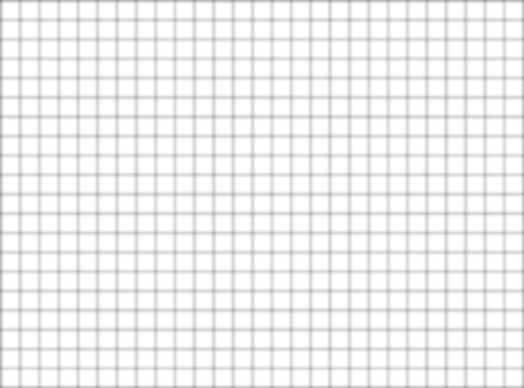
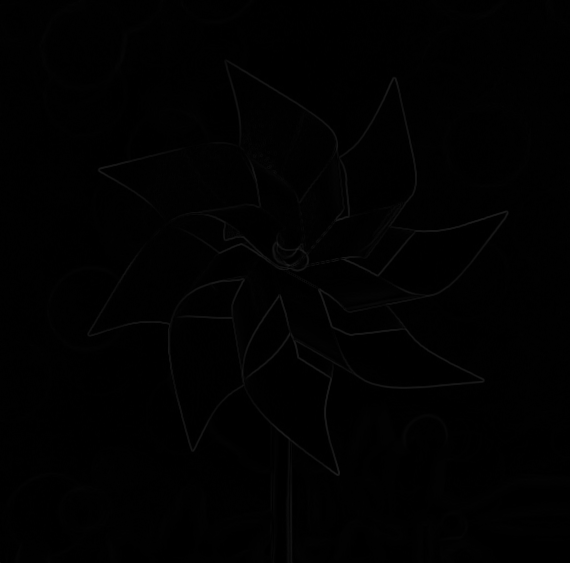
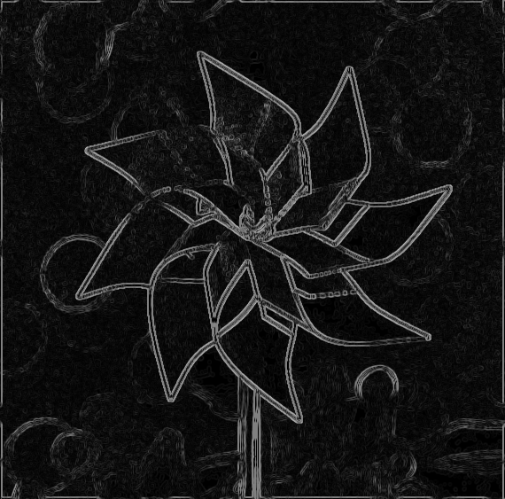
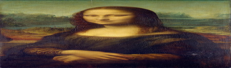
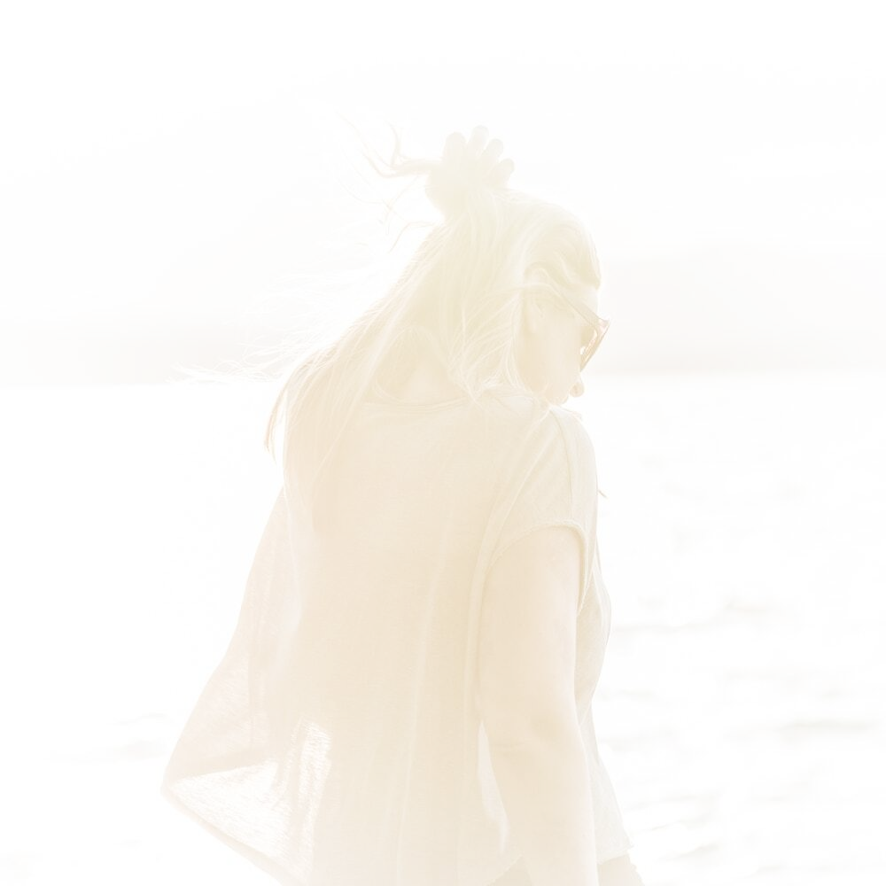

## Project 2: Filter

Please fill this out for Filter only. The project handout can be found [here](https://cs1230.graphics/projects/raster/2).

### Output Comparison

This is how you will demonstrate the functionality of your project.

Unlike Brush, you will be submitting images instead of videos for Filter.

We provide the functionality for saving the canvas of your running Filter program to a file. By default, the save dialog should open to the `student_outputs` folder, which is where the table below expects your images to be. If it does not, check that you have set your working directory to the root of the project (i.e. the folder that contains `CMakeLists.txt`).

**Do not** use your system screenshot tool or any other method to capture the canvas. You must use the save functionality provided by the program.

> Note: once all images are filled in, the images will be the same size in the expected and student outputs.

|                                                                                             Instructions                                                                                              |                             Expected Output                             |                                      Your Output                                      |
| :---------------------------------------------------------------------------------------------------------------------------------------------------------------------------------------------------: | :---------------------------------------------------------------------: | :-----------------------------------------------------------------------------------: |
|                           Load `fun_images/grid.jpeg`. Select "Blur" and set the radius to **0**. Click "Apply Filter". Save the image to `student_outputs/grid_blur_0.png`                           |    |    |
|                   Load `fun_images/grid.jpeg`. Select "Blur" and set the radius to **2**. Click "Apply Filter" **three times**. Save the image to `student_outputs/grid_blur_2.png`                   |    |    |
|                          Load `fun_images/edge.png`. Select "Blur" and set the radius to **10**. Click "Apply Filter". Save the image to `student_outputs/edge_blur_10.png`                           |  |  |
|                    Load `fun_images/edge.png`. Select "Edge detect" and set the sensitivity to **0.20**. Click "Apply Filter". Save the image to `student_outputs/edge_edge_1.png`                    |    |    |
|            Load `fun_images/edge.png`. Select "Edge detect" and set the sensitivity to **0.50**. Click "Apply Filter" **three times**. Save the image to `student_outputs/edge_edge_2.png`            |    |    |
|                    Load `fun_images/mona_lisa.jpg`. Select "Scale" and set **x to 0.20 and y to 1.00**. Click "Apply Filter". Save the image to `student_outputs/mona_lisa_1.png`                     |    |    |
|                    Load `fun_images/mona_lisa.jpg`. Select "Scale" and set **x to 1.00 and y to 0.20**. Click "Apply Filter". Save the image to `student_outputs/mona_lisa_2.png`                     |    |    |
|                        Load `fun_images/mona_lisa.jpg`. Select "Scale" and set **x and y to 0.20**. Click "Apply Filter". Save the image to `student_outputs/mona_lisa_3.png`                         |    |    |
| Load `fun_images/amongus.jpg`. Select "Scale" and set **x and y to 0.20**. Click "Apply Filter". Then set **x and y to 5.00.**. Click "Apply Filter". Save the image to `student_outputs/amongus.png` |            |                |
|                         Load `fun_images/andy.jpeg`. Select "Scale" and set **x to 1.40 and y to 1.00**. Click "Apply Filter". Save the image to `student_outputs/andy_1.png`                         |              |                      |
|                         Load `fun_images/andy.jpeg`. Select "Scale" and set **x to 1.00 and y to 1.40**. Click "Apply Filter". Save the image to `student_outputs/andy_2.png`                         |              |                      |

### Design Choices

#### Functionality

##### General

- All filters are implemented according to specification.
- Edge cases are tested, including negative parameters (e.g., in Chromatic Aberration and Rotation), zero parameters (i.e., the filter should do nothing), and unconventional parameters (e.g., having an angle degree value larger than 360 degrees in Rotation).
- All the boundary situations are handled by wrapping the image.

##### Explanation of Functionalities

- **Median Filter**: Median filtering process is implemented by first iterating in the filtered area and store all color values and sort them in ascending order. Then select the median value of the sorted lists and update the value of the pixel.
- **Chromatic Aberration**: Chromatic Aberration is implemented through 3 1D filters for each R, G, B channel. For each filter, it is essentially a shift filter which shifting direction is determined by the positive/negative of the paramter and the filter dimension is determined by the absolute value of the parameter. When applying the filter, each color channel is filtered separately.
- **Tone Mapping:**
  - **Linear Mapping:** Linear mapping is implemented by first convert the image into YCbCr color space since mapping separately for each channel in RGBA color space could modify the original color hue. In YCbCr color space, Y is used to control the brightness of the image thus the Y value of the image is mapped from the original range to [0, 255]. Then the images are converted back to RGBA color space for displaying.
  - **Non-linear Mapping:** Non-linear mapping is implemented by mapping R, G, B values according to a gamma curve controlled by gamma value. The mapped the values are clampped back to range [0, 255] to avoid overflow issues.
- **Rotation:** Rotation is implemented by though a rotation matrix (the 2D version in lab 04). For each pixel in the output image, it's x and y translation relative the center of the output image is first calculated. Then, the value of x and y translation timed throught the rotation matrix and then translated relative to the center of the source image to get the corresponding location in the source image. The areas that are outside of the source image are set to black.
- **Bilateral Smoothing:** Bilateral filter is implemented with two filters: calculting the spatial Guassian and the range Guassian. The spatial Guassian provide weights of distances between a position to the filter center and the range Guassian provide weights of intensity difference to the filter center. These two weights are multiplied together to get the final weights.

#### Software Engineering, Efficiency, Stability

- Operation codes (e.g., applying filters, etc.), object codes (e.g., filters), and functional codes (e.g., helper functions, checking functions, comparing functions, etc.) are all properly separated and packed into functions. Functions are properly called and reused to reduce unecessarily long and concoluted code.
- The code are properly annotated and organized in blocks for better readability.

### Collaboration/References

I clarify that there is no collaboration include when I do this project.

References for mathematical formulas only (no code are referenced):

- Gamma Correction: https://en.wikipedia.org/wiki/Gamma_correction
- Bilateral Filter: http://people.csail.mit.edu/sparis/bf_course/

References for helper functions from lab 03:
- Boundary condition handling functions: getPixelRepeated, getPixelReflected, getPixelWrapped.

### Known Bugs

Currently there are no obvious bugs related to functionality, though there might be slight differences between the output of TA demo and my code output due to different in-function parameter settings.

### Extra Credit

#### Median

| Median Radius of 2 | Median Radius of 5 |
|:---:|:---:|
|  |  |

#### Chromatic Aberration

| Settings (0, -5, 0) | Settings (-1, 1, 2) |
|:---:|:---:|
|  |  |

Note: The boundary handling used in my code is wrapping.

#### Tone Mapping

| Linear Function | Gamma = 2 |  Gamma = 0.5 |
|:---:|:---:|:---:|
|  |  |  |

#### Rotation

| Rotation of 69 degrees | Rotation of 142 degrees |
|:---:|:---:|
|  |  |

#### Bilateral Smoothing

| Bilateral Radius of 10 | Bilateral Radius of 50 |
|:---:|:---:|
|  |  |
